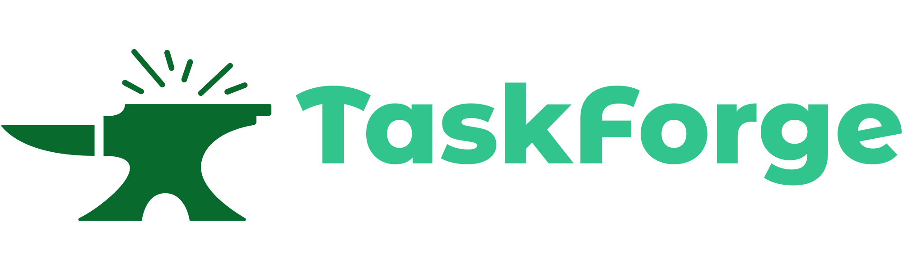

<p align="center">
 
</p>


<h2>Sumário</h2>
<ul>
 <li><a href="#introdução">Introdução</a></li>
 <li><a href="#sobre">Sobre o Projeto</a></li>
 <li><a href="#tecnologias">Tecnologias Utilizadas</a></li>
 <li><a href="#diagrama">Diagrama de Classes</a></li>
 <li><a href="#regras">Regras de Negócio</a></li>
 <li><a href="#endpoints">Endpoints</a></li> 
 <li><a href="#melhorias">Pontos de Melhoria</a></li> 
</ul>

## Introdução 

Projeto de desafio Desenvolvedor Java FullStack. Para criação desse projeto foi considerado uma aplicação que fosse bonita, simples porém moderna. O tema fora designado junto aos requisitos propostos, no qual eram a utilização de algumas tecnologias juntamente com a elaboração do projeto web.

## Sobre 

O Projeto TaskForge trata-se de uma aplicação FullStack em que se dá uma plataforma para gerenciamento de projetos e funcionários os quais são diretamente vinculados uns aos outros por intemédio de uma tabela denominada ```membros```. A aplicação possui uma estrutura de CRUD com os principais métodos HTTP (GET/PUT/UPDATE/DELETE).
O sistema foi desenvolvido em Java e Spring com as configurações realizadas com Spring Boot, as entidades foram mapeadas utilizando Spring Data Jpa e Hibernate e os dados foram persistidos no Banco de Dados PostgresSQL.

Para gerenciamento de dependências foi utilizado o Maven, juntamente com o jUnit para elaboração dos testes de services e outras classes as quais não sofriam controle direto da entidade JPA.

Além do mais, foi usado o Design Pattern MVC, empregando o uso da camada de Repository com a função de agir como intermédio entre outras camadas, o Service para proteger a lógica de negócios da aplicação, os Controllers com a responsabilidade de processar as requisições e gerar as respostas, inclusive, também foi utilizado o padrão de arquitetura de DTOs (Data Transfer Objects), para aumentar a segurança das classes na transferência de dados. Além disso, foram criadas Exceptions personalizadas para gerar logs, e mensagens de erros mais coerentes ao usuário.

No Frontend as tecnologias utilizadas foram React.js, inicializado pelo Vite, juntamente do Boodstrap, Toastr do React-Toastify e ícones do Font Awesome.

Para a parte de banco de dados foi utilizado o banco de dados PostgreSQL para elaboração do projeto, seguindo o modelo de tabelas proposto. Além disso, foi utilizado banco de dados H2 para a realização dos testes - dessa maneira a utilização dos testes torna-se mais eficiente por conta da complexidade e estrutura nescessária para comportar um banco de dados de homologação por exemplo-.


## Tecnologias

<p>
   
   
   
   
   
   
   
   
</p>

## Diagrama 

<div style="display: flex; justify-content: center; align-items: center;">
  <p style="text-align: center;">
    <a href="Diagrama-de-Classes.svg" target="_blank">Clique aqui para ver o Diagrama de Classes</a>
  </p>
</div>

## Regras 

- O sistema deve permitir o cadastro (inserção, exclusão, alteração e consulta) de projetos. Para cada projeto devem ser informados: nome, data de início, gerente responsável, previsão de término, data real de término, orçamento total, descrição e status.

- Os projetos devem ser classificados em: baixo risco, médio risco e alto risco. A classificação de risco não é cadastrada no sistema.

- A cada instante, o projeto deve estar em um status específico e único. Os status possíveis não são cadastrados no sistema e são: em análise, análise realizada, análise aprovada, iniciado, planejado, em andamento, encerrado, cancelado.

- Se um projeto foi mudado o status para iniciado, em andamento ou encerrado não pode mais ser excluído.

- O sistema não deve permitir o cadastro de um novo membro diretamente.

- Deve ser provida funcionalidade via web service, contendo nome e atribuição (cargo).

- O sistema deve permitir associar membros aos projetos que tem atribuição funcionário.

## Endpoints 

Abaixo seguem os principais endpoints. Na collection axedada estão mapeados todos os endpoints disponíveis na aplicação. Nem todos foram utilizados durante a implementação do frontend.

- cpf e datas precisam estar no formato correto
    - cpf: "000.000.000-00"
    - datas: "yyyy-mm-dd"


#### /Pessoa
 
Método POST para criar uma nova Pessoa

```json
{
  "nome": "String",
  "dataNascimento": "yyyy-mm-dd",
  "cpf": "000.000.000-00",
  "funcionario": "Boolean",
  "gerente": "Boolean",
  "cargo": "String" 
}
```

#### /Projeto
 
Método POST para criar um novo Projeto


```json
{
    "nome": "String",
    "dataInicio": "yyyy-mm-dd",
    "dataPrevisaoFim": "yyyy-mm-dd",
    "descricao": "String",
    "status": "ENUM",
    "orcamento": "Double",
    "risco": "ENUM",
    "idGerente": "Integer",
    "funcionarios": [
        {
            "value": "Integer",
            "label": "String"
        }
    ]
}
```

#### /Membros
 
Método POST para criar um novo Membro


```json
{
    "idPessoa": "Integer",
    "idProjeto": "Integer"
}
```

 
<h3>Execução</h3>

<p>Para executar os endpoints através do Postman, utilize esta Collection: 

[](https://elements.getpostman.com/redirect?entityId=24093493-7dc8e626-46ec-481b-9042-bb802887b86e&entityType=collection) </p>
 
## Melhorias 

- [ ] Adequação de teste unitários para um modelo mais elaborado e melhor utilização do Mockito;
- [ ] Implementação de Drag and Drop para alterar o status de um projeto - fazendo com que não seja preciso abrir o mesmo para edição - ; 
- [ ] Ajustes nas mascaras de dados;
- [ ] Validação da origem da requisição - atualmente está aceitando requisição vinda de qualquer origem -;
- [ ] Migrations para criação de tabelas e popular Database;
- [ ] Testes de integração na camada Controller;
